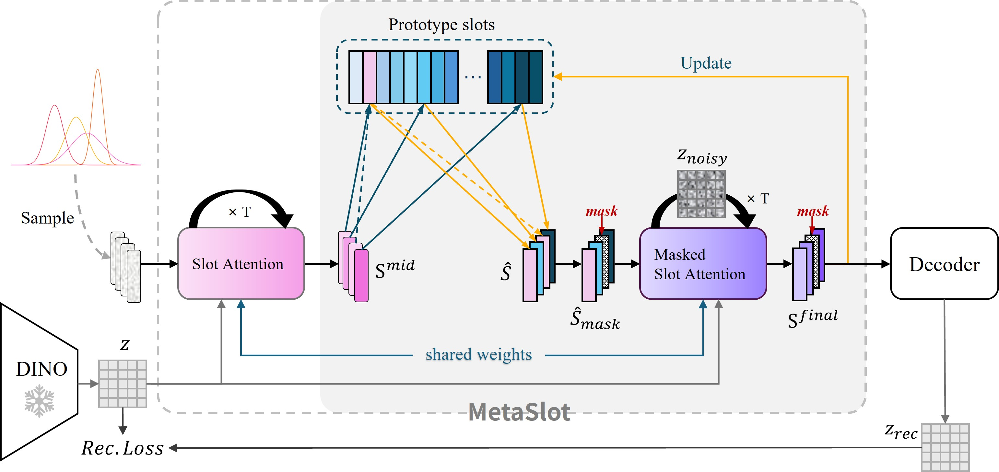
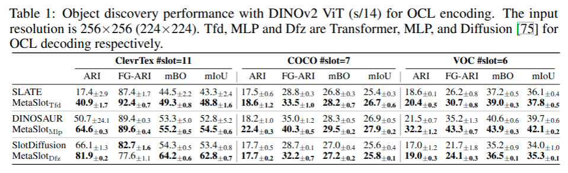

# MetaSlot: Break Through the Fixed Number of Slots in Object-Centric Learning

## 📄 Paper  

[**MetaSlot: Break Through the Fixed Number of Slots in Object-Centric Learning** — arXiv:2505.20772](https://arxiv.org/abs/2505.20772)  

✅ Accepted as a **Poster Paper** at [NeurIPS 2025](https://neurips.cc/) 🎉
---
<p align="center">
  
</p>

[]()
[]()
[]()

---

## 🔥 Introduction  

**MetaSlot** is a novel **aggregation module** for **Object-Centric Learning (OCL)** that overcomes two long-standing limitations of conventional **Slot Attention** models:  

- 🚫 **Fixed number of slots**  
- 🎲 **Random slot initialization**  

Our approach introduces:  
1. A **global vector-quantized (VQ) prototype codebook**  
2. A **two-stage aggregate-and-deduplicate framework**  

Together, they enable more **adaptive**, **robust**, and **interpretable** slot representations.  

---

## 🗂️ Repository Structure  

```

MetaSlot/
│── object_centric_bench/model/metaslot.py   # Core implementation of MetaSlot
│── configs/                                 # Example configs
│    ├── dinosaur_r-voc.py                   # DINOSAUR with MetaSlot
│    ├── vqvae-voc-c4.py                     # VQ-VAE pretraining
│    ├── slotdiffusion_r_vqvae-voc.py        # SlotDiffusion with MetaSlot
│    └── slate_r_vqvae-voc.py                # SLATE with MetaSlot
│── train.py                                 # Training script

````

---
## Converted Datasets 🚀

Converted datasets, including ClevrTex, COCO, VOC and MOVi-D are available as [releases](https://github.com/Genera1Z/VQ-VFM-OCL/releases).
- [dataset-clevrtex](https://github.com/Genera1Z/VQ-VFM-OCL/releases/tag/dataset-clevrtex): converted dataset [ClevrTex](https://www.robots.ox.ac.uk/~vgg/data/clevrtex).
- [dataset-coco](https://github.com/Genera1Z/VQ-VFM-OCL/releases/tag/dataset-coco): converted dataset [COCO](https://cocodataset.org).
- [dataset-voc](https://github.com/Genera1Z/VQ-VFM-OCL/releases/tag/dataset-voc): converted dataset [VOC](http://host.robots.ox.ac.uk/pascal/VOC).
- [dataset-movi_d](https://github.com/Genera1Z/VQ-VFM-OCL/releases/tag/dataset-movi_d): converted dataset [MOVi-D](https://github.com/google-research/kubric/blob/main/challenges/movi).

---

## 🚀 Getting Started  

### Install dependencies  

```bash
conda create -n MetaSlot python=3.10
conda activate MetaSlot
pip install -r requirements.txt
````

## 🏋️ Train

### 1. Training with DINOSAUR + MetaSlot

```bash
python train.py \
    --data_dir ./data \
    --cfg_file ./Config/config-metaslot/dinosaur_r-voc.py
```

### 2. Training SlotDiffusion + MetaSlot (requires VQ-VAE pretraining)

```bash
# Step 1: Train VQ-VAE
python train.py \
    --data_dir ./data \
    --cfg_file ./Config/config-metaslot/vqvae-voc-c4.py

# Step 2: Train SlotDiffusion with pretrained VQ-VAE
python train.py \
    --data_dir ./data \
    --cfg_file ./Config/config-metaslot/slotdiffusion_r_vqvae-voc.py \
    --ckpt_file {your_vqvae_best_ckpt.pth}
```

### 3. Training SLATE + MetaSlot (requires VQ-VAE pretraining)

```bash
# Step 1: Train VQ-VAE
python train.py \
    --data_dir ./data \
    --cfg_file ./Config/config-metaslot/vqvae-voc-c256.py

# Step 2: Train SLATE with pretrained VQ-VAE
python train.py \
    --data_dir ./data \
    --cfg_file ./Config/config-metaslot/slate_r_vqvae-voc.py \
    --ckpt_file {your_vqvae_best_ckpt.pth}
```

## 🔍 Eval

```bash
python eval.py \
    --data_dir ./data \
    --cfg_file ./Config/config-metaslot/{your_model_config.py} \
    --ckpt_file {your_ckpt.pth}
```

---

## 🧩 Integration

MetaSlot is **plug-and-play** 🔌 and can be seamlessly integrated into most OCL pipelines.
Simply replace the original aggregator with:

```python
from object_centric_bench.model.metaslot import MetaSlot
aggregator = MetaSlot(...)
```

---

## 📊 Results (Teaser)


---

## Acknowledgments

We thank the authors of the following projects for making their code open source:

- [VQ-VFM-OCL](https://github.com/Genera1Z/VQ-VFM-OCL)

---

## Citation

If you find our work useful, please cite:  

**BibTeX**  
```bibtex
@article{liu2025metaslot,
  title={MetaSlot: Break Through the Fixed Number of Slots in Object-Centric Learning},
  author={Liu, Hongjia and Zhao, Rongzhen and Chen, Haohan and Pajarinen, Joni},
  journal={arXiv preprint arXiv:2505.20772},
  year={2025}
}

```

---

## 📬 Contact

I am a master's student with research interests in representation learning and robotic manipulation.  

For questions or potential collaborations, please feel free to open an issue or reach out via email:  

📧 hongjia.liu@aalto.fi
