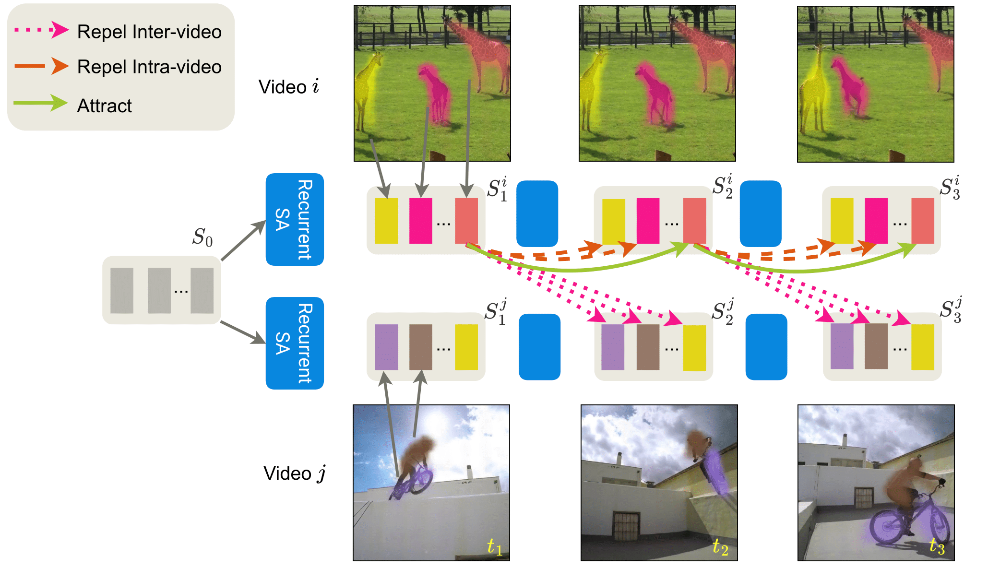

# SlotContrast

This is the code release for the paper **Temporally Consistent Object-Centric Learning by Contrasting Slots (CVPR 2025 Oral)**, by Anna Manasyan, Maximilian Seitzer, Filip Radovic, Georg Martius, Andrii Zadaianchuk.

- [Webpage](https://slotcontrast.github.io/)
- [Arxiv](https://arxiv.org/abs/2412.14295)



## Summary

Unsupervised object-centric learning from videos is a promising approach to extract structured representations from large, unlabeled collections of videos. To support downstream tasks like autonomous control, these representations must be both compositional and temporally consistent. Existing approaches based on recurrent processing often lack long-term stability across frames because their training objective does not enforce temporal consistency. In this work, we introduce a novel object-level temporal contrastive loss for video object-centric models that explicitly promotes temporal consistency. Our method significantly improves the temporal consistency of the learned object-centric representations, yielding more reliable video decompositions that facilitate challenging downstream tasks such as unsupervised object dynamics prediction. Furthermore, the inductive bias added by our loss strongly improves object discovery, leading to state-of-the-art results on both synthetic and real-world datasets, outperforming even weakly-supervised methods that leverage motion masks as additional cues.

## Usage

### Setup

First, setup the python environment setup. We use [Poetry](https://python-poetry.org/) for this:

```
poetry install
```
### Install Options

- `poetry install -E tensorflow` to be able to convert tensorflow datasets
- `poetry install -E coco` to use coco API
- `poetry install -E notebook` to use jupyter notebook and matplotlib

Then you could run a test configuration to see if everything works:

```
poetry run python -m slotcontrast.train tests/configs/test_dummy_image.yml
```

Second, to download the datasets used in this work, follow the instructions in [data/README.md](data/README.md).
By default, datasets are expected to be contained in the folder `./data`.
You can change this to the actual folder your data is in by setting the environment variable `SLOTCONTRAST_DATA_PATH`, or by running `train.py` with the `--data-dir` option.

### Training

Run one of the configurations in `configs/slotcontrast`, for example:

```
poetry run python -m slotcontrast.train configs/slotcontrast/movi_c.yml
```

The results are stored in a folder created under the log root folder (by defaults `./logs`, changeable by the argument `--log-dir`).
If you want to continue training from a previous run, you can use the `--continue` argument, like in the following command:

```
poetry run python -m slotcontrast.train --continue <path_to_log_dir_or_checkpoint_file> configs/slotcontrast/movi_c.yml
```

### Inference
If you want to run one of the released checkpoints (see below) on your own video you can use inference script with corresponding config file:

```
poetry run python -m slotcontrast.inference --config configs/inference/movi_c.yml
```
in the released config, please change `checkpoint: path/to/slotcontrast-movi-c.ckpt` to the real path to your checkpoint.
For different video formats you would need to modify corresponding transformations in `build_inference_transform` function.

## Results

### SlotContrast

We list the results you should roughly be able to obtain with the configs included in this repository:

| Dataset      | Model Variant    | Video ARI | Video mBO | Config                      | Checkpoint Link                                                                                             |
|--------------|------------------|-----------|-----------|-----------------------------|------------------------------------------------------------------------------------------------------------|
| MOVi-C       | ViT-S/14, DINOv2    |  69.3    |  32.7     | slotcontrast/movi_c.yml        | [Checkpoint](https://huggingface.co/annamanasyan/slotcontrast/resolve/main/movi_c.ckpt) |
| MOVi-E       | ViT-B/14, DINOv2    | 82.9      | 29.2     | slotcontrast/movi_e.yml        | [Checkpoint](https://huggingface.co/annamanasyan/slotcontrast/resolve/main/movi_e.ckpt) |
| YT-VIS 2021  | ViT-B/14, DINOv2   | 38.0      | 33.7      | slotcontrast/ytvis2021.yml         | [Checkpoint](https://huggingface.co/annamanasyan/slotcontrast/resolve/main/ytvis.ckpt)   |
|


## Citation

```
 @inproceedings{manasyan2025temporally,
        title={Temporally Consistent Object-Centric Learning by Contrasting Slots},
        author={Manasyan, Anna and Seitzer, Maximilian and Radovic, Filip and Martius, Georg and Zadaianchuk, Andrii},
        booktitle={Proceedings of the IEEE/CVF Conference on Computer Vision and Pattern Recognition (CVPR)},
        year={2025}
      } 
```

## Acknowledgement
The codebase is adapted from [Videosaur](https://github.com/martius-lab/videosaur)

## License

This codebase is released under the MIT license.
Some parts of the codebase were adapted from other codebases.
A comment was added to the code where this is the case.
Those parts are governed by their respective licenses.
